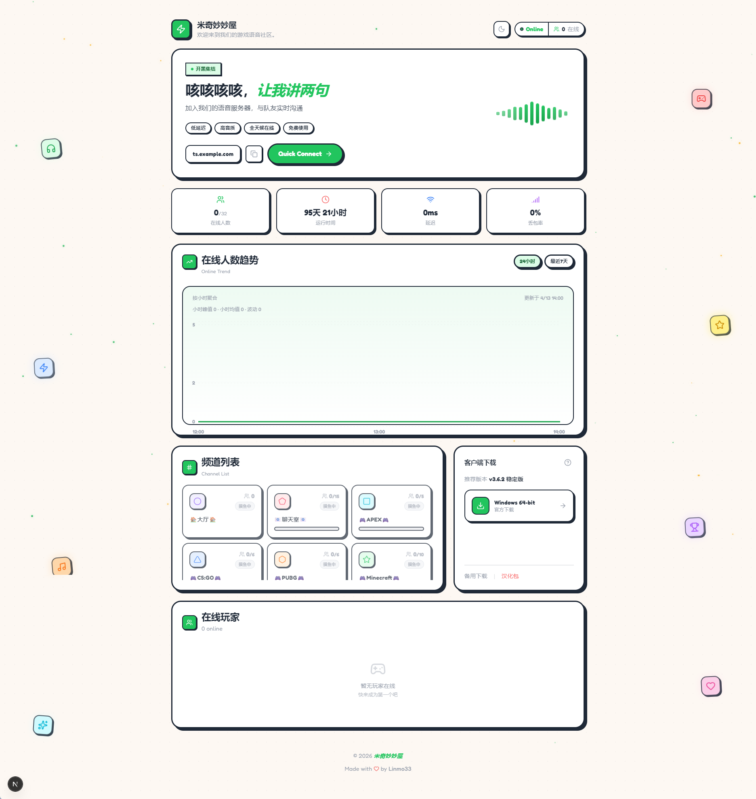

# TS3 Server Hub

[](https://nextjs.org/)
[](https://www.typescriptlang.org/)
[](https://tailwindcss.com/)
[](LICENSE)

TeamSpeak 3 服务器实时监控面板，采用清新现代的 UI 设计，展示服务器状态和在线用户信息。

## 预览



## 功能特性

- **实时监控** - 在线人数、延迟、丢包率等服务器状态
- **用户列表** - 展示当前在线用户及其频道信息
- **历史趋势** - 24小时在线人数流量图表
- **一键连接** - 快速复制服务器地址或直接启动 TS3 客户端
- **客户端下载** - 提供 Windows 下载链接
- **视觉效果** - 粒子背景、浮动图标视差效果、音波动画

## 技术栈

| 技术 | 说明 |
|------|------|
| [Next.js 16](https://nextjs.org/) | React 全栈框架 (App Router) |
| [TypeScript](https://www.typescriptlang.org/) | 类型安全 |
| [Tailwind CSS](https://tailwindcss.com/) | 原子化 CSS |
| [ts3-nodejs-library](https://github.com/Multivit4min/TS3-NodeJS-Library) | TS3 ServerQuery 客户端 |
| [Lucide React](https://lucide.dev/) | 图标库 |
| [Recharts](https://recharts.org/) | 图表组件 |

## 快速开始

### 环境要求

- Node.js 18+
- pnpm (推荐) / npm / yarn

### 安装

```bash
# 克隆仓库
git clone https://github.com/linmo-33/ts3-server-web.git
cd ts3-server-hub

# 安装依赖
pnpm install

# 复制环境变量配置
cp .env.example .env.local
```

### 环境变量

编辑 `.env.local` 文件：

```env
# ==========================================
# 服务端配置 (私有)
# ==========================================
# TS3 Server Query 连接
TS3_SERVER_HOST=your-ts3-server.com    # TS3 服务器地址
TS3_QUERY_PORT=10011                   # Query 端口 (默认 10011)
TS3_QUERY_USERNAME=serveradmin         # Query 用户名
TS3_QUERY_PASSWORD=your-password       # Query 密码
TS3_SERVER_ID=1                        # 虚拟服务器 ID
TS3_VIRTUAL_PORT=9987                  # 虚拟服务器端口

# 可选配置
TS3_CONNECTION_TIMEOUT=30000           # 连接超时 (毫秒)
TS3_CACHE_TTL=30000                    # 缓存时间 (毫秒)
RATE_LIMIT_WINDOW_MS=60000             # 限流窗口
RATE_LIMIT_MAX_REQUESTS=30             # 每窗口最大请求数

# ==========================================
# 客户端配置 (公开)
# ==========================================
NEXT_PUBLIC_SERVER_NAME=我的服务器        # 显示的服务器名称
NEXT_PUBLIC_SERVER_DESCRIPTION=欢迎加入   # 服务器描述
NEXT_PUBLIC_SERVER_ADDRESS=ts.example.com # 显示的连接地址
```

### 开发

```bash
pnpm dev
```

访问 [http://localhost:3000](http://localhost:3000)

### 构建

```bash
pnpm build
pnpm start
```

## 部署

### Vercel

[](https://vercel.com/new/clone?repository-url=https://github.com/linmo-33/ts3-server-web)

1. 点击上方按钮或在 Vercel 导入项目
2. 在 Settings → Environment Variables 配置环境变量
3. 部署完成


## 项目结构

```
src/
├── app/                 # Next.js App Router
│   ├── api/            # API 路由
│   └── page.tsx        # 主页面
├── components/         # React 组件
│   ├── sections/       # 页面区块组件
│   └── ...             # 通用组件
├── hooks/              # 自定义 Hooks
├── lib/                # 工具库
├── types/              # TypeScript 类型
└── constants/          # 常量配置
```

## License

[MIT](LICENSE)
