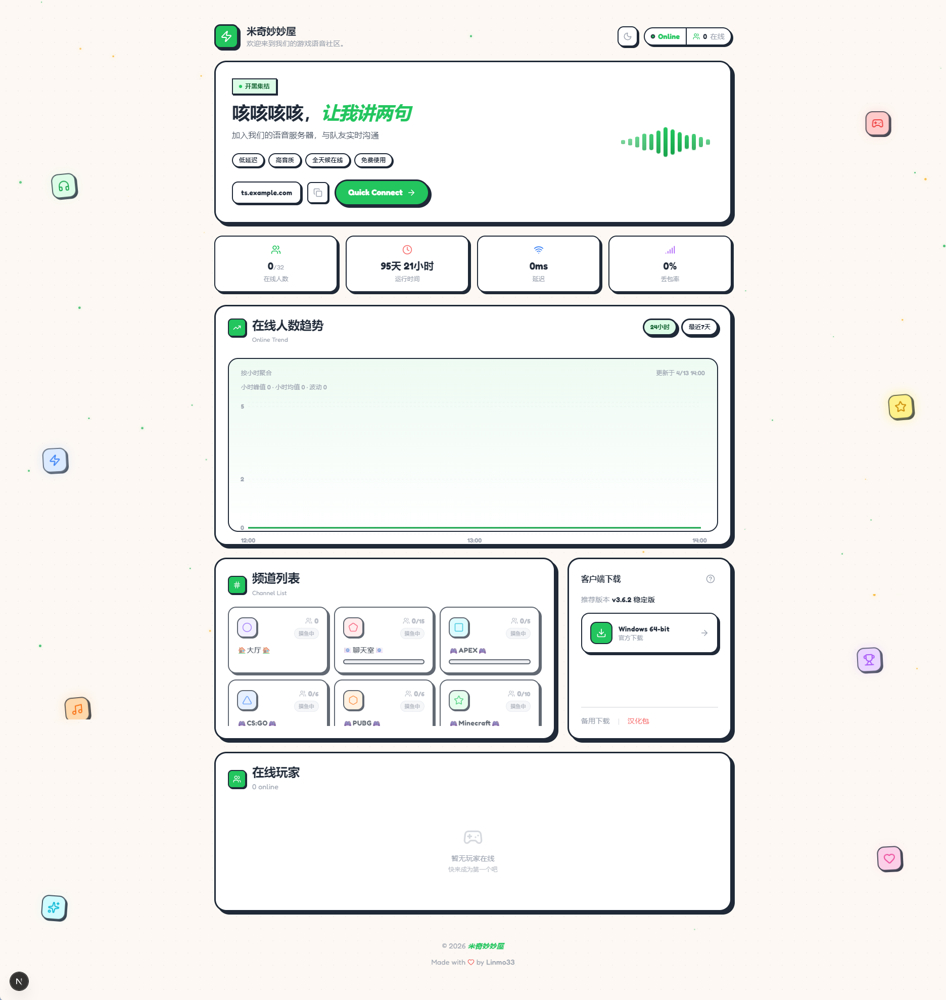

# TS3 Server Hub

[](https://nextjs.org/)
[](https://www.typescriptlang.org/)
[](https://tailwindcss.com/)
[](LICENSE)

为 TeamSpeak 服务器打造的现代化实时监控面板，以清晰流畅的界面集中展示服务器状态、在线用户与频道分布，让服务器运行情况一目了然，支持传统 TS3 ServerQuery 与 TS6 SSH Query。

## 预览



## 功能特性

- **实时监控** - 在线人数、延迟、丢包率等服务器状态
- **用户列表** - 展示当前在线用户及其频道信息
- **频道列表** - 展示频道人数、容量与占用情况
- **主题切换** - 支持浅色与暗色主题自由切换
- **一键连接** - 快速复制服务器地址或直接启动 TS3 客户端
- **客户端下载** - 提供 Windows 下载链接
- **视觉效果** - 粒子背景、浮动图标视差效果、音波动画

## 技术栈

| 技术                                                                     | 说明                        |
| ------------------------------------------------------------------------ | --------------------------- |
| [Next.js 16](https://nextjs.org/)                                        | React 全栈框架 (App Router) |
| [TypeScript](https://www.typescriptlang.org/)                            | 类型安全                    |
| [Tailwind CSS](https://tailwindcss.com/)                                 | 原子化 CSS                  |
| [teamspeak.js](https://github.com/teamspeakjs/teamspeak.js)              | TS3 / TS6 ServerQuery 客户端 |
| [Lucide React](https://lucide.dev/)                                      | 图标库                      |
| [Recharts](https://recharts.org/)                                        | 图表组件                    |

## 快速开始

### 环境要求

- Node.js 18+
- pnpm (推荐) / npm / yarn

### 安装

```bash
# 克隆仓库
git clone https://github.com/linmo-33/ts3-server-web.git
cd ts3-server-hub

# 安装依赖
pnpm install

# 复制环境变量配置
cp .env.example .env
```

### 环境变量

编辑 `.env` 文件：

```env
# ==========================================
# 服务端配置 (私有)
# ==========================================
# Query 连接
TS_SERVER_HOST=your-teamspeak-server.com # TeamSpeak 服务器地址
TS_QUERY_PROTOCOL=tcp                    # tcp=TS3, ssh=TS6
TS_QUERY_PORT=10011                      # tcp 默认 10011, ssh 默认 10022
TS_QUERY_USERNAME=serveradmin            # Query 用户名 / SSH 用户名
TS_QUERY_PASSWORD=your-password          # Query 密码 / SSH 密码
TS_QUERY_NICKNAME=WebQuery               # 仅 tcp 模式使用
TS_SERVER_ID=1                           # TS3 虚拟服务器 ID，优先于虚拟端口
TS_VIRTUAL_PORT=9987                     # TS3 虚拟服务器端口

# 可选配置
TS_CONNECTION_TIMEOUT=30000            # 连接超时 (毫秒)
TS_CACHE_TTL=30000                     # 缓存时间 (毫秒)
TRUST_PROXY_HEADERS=false              # 仅在可信反向代理后才开启
RATE_LIMIT_WINDOW_MS=60000             # 限流窗口
RATE_LIMIT_MAX_REQUESTS=30             # 每窗口最大请求数
RATE_LIMIT_MAX_KEYS=5000               # 限流键上限，避免内存无限增长

# ==========================================
# 页面显示配置 (公开，运行时读取)
# ==========================================
SERVER_NAME=我的服务器                  # 显示的服务器名称
SERVER_DESCRIPTION=欢迎加入             # 服务器描述
SERVER_ADDRESS=ts.example.com           # 显示的连接地址
DISPLAY_CHANNEL_NAMES=大厅,APEX,CS:GO   # 可选：频道白名单，逗号分隔
```

说明：

- 页面展示配置在服务运行时读取，适合 Docker 直接使用预构建镜像部署。
- 为了兼容旧配置，`NEXT_PUBLIC_SERVER_*` 仍然可用，但新部署建议改用 `SERVER_*`。
- 旧的 `TS3_*` 查询环境变量仍然兼容，但新部署建议改用 `TS_*`。
- `tcp` 模式用于传统 TS3 ServerQuery；`ssh` 模式用于 TS6 Query。
- `TRUST_PROXY_HEADERS` 默认关闭，只有在应用明确部署在可信反向代理之后时才应开启。

> 避免展示频道中的装饰性频道，建议使用频道白名单

频道显示规则：

- 有人的频道始终显示
- 如果配置了 `DISPLAY_CHANNEL_NAMES`，白名单频道始终显示；未命中的无人频道不显示
- 如果未配置 `DISPLAY_CHANNEL_NAMES`，默认显示所有名称非空的频道

### 开发

```bash
pnpm dev
```

访问 [http://localhost:3000](http://localhost:3000)

### 构建

```bash
pnpm build
pnpm start
```

## 部署

### Vercel

[](https://vercel.com/new/clone?repository-url=https://github.com/linmo-33/ts3-server-web)

1. 点击上方按钮或在 Vercel 导入项目
2. 在 Settings → Environment Variables 配置环境变量
3. 部署完成

### Docker Compose

1. 复制环境变量文件并按需修改：

```bash
cp .env.example .env
```

2. 拉取镜像：

```bash
docker pull ghcr.io/linmo-33/ts3-server-web:latest
```

3. 使用 [docker-compose.yml](./docker-compose.yml) 启动服务：

```bash
docker compose up -d
```

`SERVER_*` 页面展示配置会在容器启动后由服务端运行时读取，不需要重新构建镜像。

4. 查看运行状态与日志：

```bash
docker compose ps
docker compose logs -f
```

5. 停止服务：

```bash
docker compose down
```

## 项目结构

```
src/
├── app/                 # Next.js App Router
│   ├── api/            # API 路由
│   └── page.tsx        # 主页面
├── components/         # React 组件
│   ├── sections/       # 页面区块组件
│   └── ...             # 通用组件
├── hooks/              # 自定义 Hooks
├── lib/                # 工具库
├── types/              # TypeScript 类型
└── ...                 # 其他模块
```

## License

[MIT](LICENSE)
